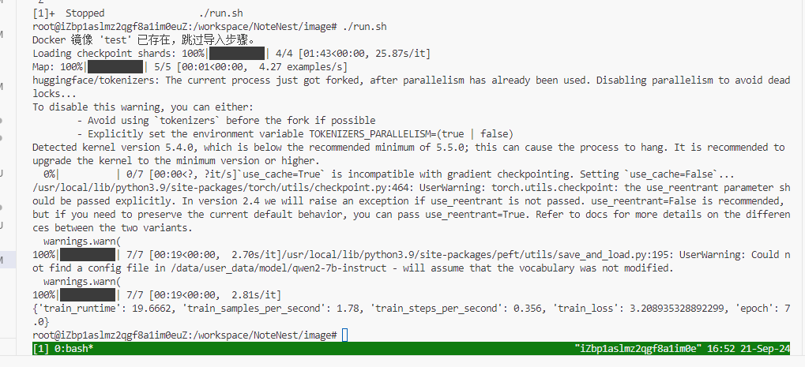

# 使用说明

## 1. 环境准备

### 操作系统

* **操作系统版本**：建议使用 Ubuntu 20.04 或更高版本。

### Python 版本
* **CUDA:12.2、CUDNN:8902**
* **Python**：3.10 

### 必需依赖包（镜像内已装好）

请在开始前，确保已经安装以下依赖。你可以通过以下命令安装依赖：

```bash
pip install pandas transformers peft accelerate sentencepiece datasets tiktoken openpyxl protobuf einops

```

## 2. 运行说明

### 步骤 1：准备数据和代码

1. **`data/`目录**：请将训练数据放置于 `data` 目录下：
   * `data/raw_data/`：包含原始数据集文件，运行时将替换为官方数据。
   * `data/user_data/`：用于保存选手的模型文件、中间结果、数据、权重等。
   * `data/prediction_result/`：用于保存最终预测的结果，`result.csv`文件。
2. **`data/code/`目录**：请将程序的入口代码 `main.py` 放置于 `data/code/` 目录下。所有的训练和预测逻辑应在 `main.py` 中实现。

### 步骤 2：运行 `run_sft.sh` 脚本,进行模型训练。

1. 请确保 `docker.tar` 镜像文件和 `run.sh` 脚本位于 `image` 目录下。

2. 进入 `image` 目录，运行以下命令启动 Docker 容器并开始训练：

   ```bash复制代码
   cd image
   ./run_sft.sh
   ```
**以下为训练代码测试截图**

脚本会自动执行以下操作：

1. 检查 Docker 是否已安装并支持 GPU。
2. 检查是否已经存在名为 `test` 的 Docker 镜像，如果没有，则从 `docker.tar` 文件中加载镜像。
3. 挂载 `data` 目录，并启动 Docker 容器，在 `/data/code` 目录下执行 `sft.py`。

### 步骤 3：运行 `run_infer.sh` 脚本,进行问题推理。

1. 请确保 `docker.tar` 镜像文件和 `run.sh` 脚本位于 `image` 目录下。

2. 进入 `image` 目录，运行以下命令启动 Docker 容器并开始训练：

   ```bash复制代码
   cd image
   ./run_infer.sh
   ```
**以下为推理代码测试截图**

脚本会自动执行以下操作：

1. 检查 Docker 是否已安装并支持 GPU。
2. 检查是否已经存在名为 `test` 的 Docker 镜像，如果没有，则从 `docker.tar` 文件中加载镜像。
3. 挂载 `data` 目录，并启动 Docker 容器，在 `/data/code` 目录下执行 `main.py`。

### 步骤 4：查看推理输出结果

* **训练结果**：训练模型权重等会被保存在 `data/user_data/sft_lora` 目录下。
* **预测结果**：预测结果将保存为 `data/prediction_result/result.csv` 文件。

