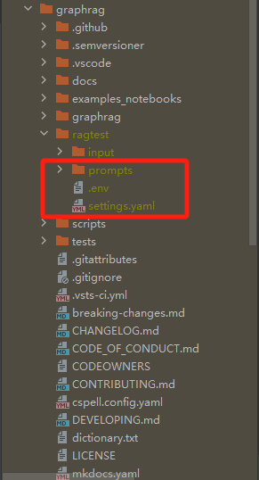
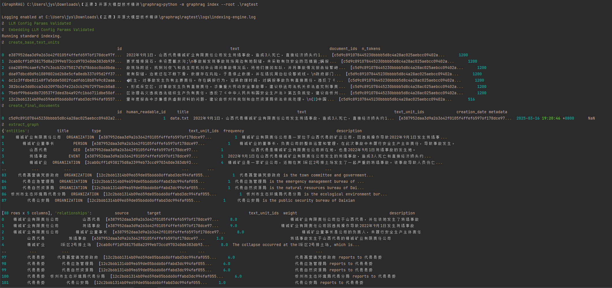
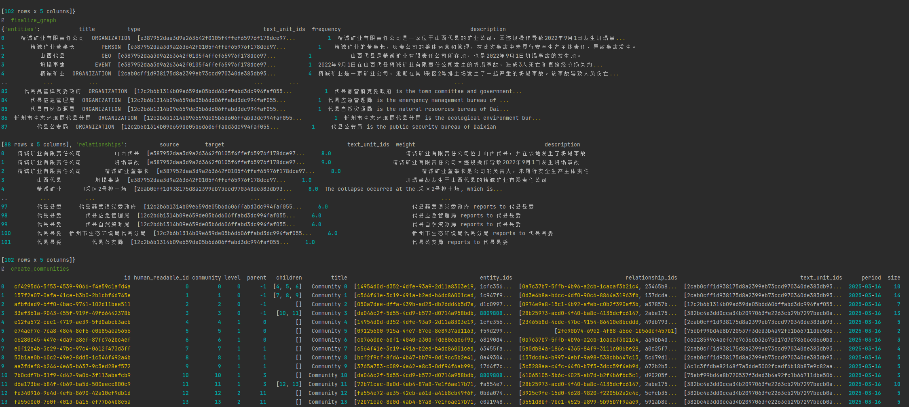
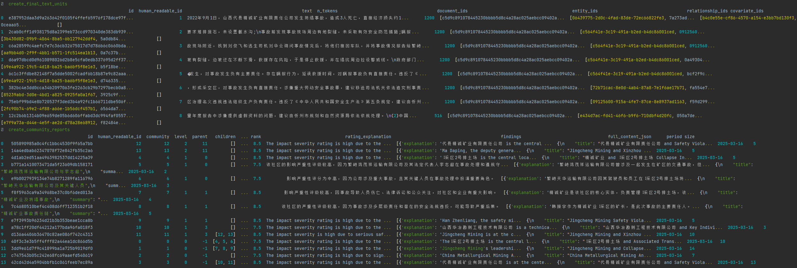
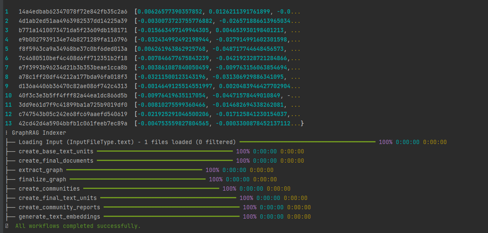
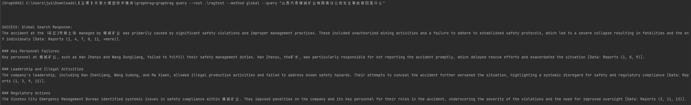
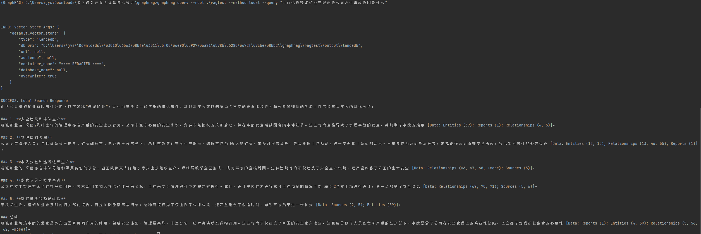
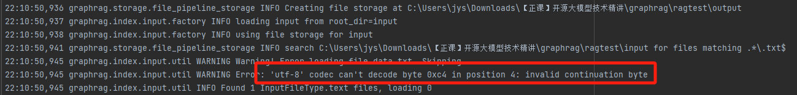
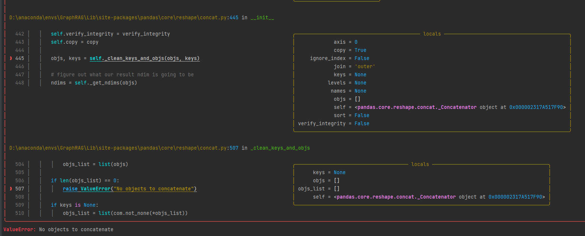

# graphrag项目学习

## 1.环境安装

```bash
conda create -n GraphRAG python=3.11
conda activate GraphRAG 
pip install graphrag

git clone https://github.com/microsoft/graphrag.git
mkdir -p .\ragtest\input
python -m graphrag init --root .\ragtest
```
运行完上面命令后，目录形式如下：



在**settings.yaml**中， 添加model、api_base对应的属性值，若是直连模式，则不需要api_base
在**env**文件中，添加所使用模型的api_key

## 2.索引构建过程
```bash
python -m graphrag index --root .\ragtest
```

索引构建日志





## 3.graphrag问答

```bash
graphrag query --root .\ragtest --method local --query "山西代县精诚矿业有限责任公司发生事故原因是什么"
graphrag query --root .\ragtest --method global --query "山西代县精诚矿业有限责任公司发生事故原因是什么"
```



## 错误


解决方式：本地txt文件，使用utf-8编码



解决方式： 在settings.yaml中，添加:  **encoding_model: cl100k_base**

openai.BadRequestError: Error code: 400 - {'error': {'code': 'InvalidParameter', 'param': None, 'message': '<400> InternalError.Algo.InvalidParameter: Value error, batch size is invalid, it should not be larger than 10.: input.contents', 'type': 'InvalidParameter'}, 'id': 'bcac04a7-19f7-94cf-a09e-3464ee6b6bd2', 'request_id': 'bcac04a7-19f7-94cf-a09e-3464ee6b6bd2'}
22:32:14,959 graphrag.callbacks.file_workflow_callbacks INFO Error running pipeline! details=None
22:32:14,977 httpx INFO HTTP Request: POST https://dashscope.aliyuncs.com/compatible-mode/v1/embeddings "HTTP/1.1 400 Bad Request"

在settings.yaml中，降低concurrent_requests的值，或者换模型
